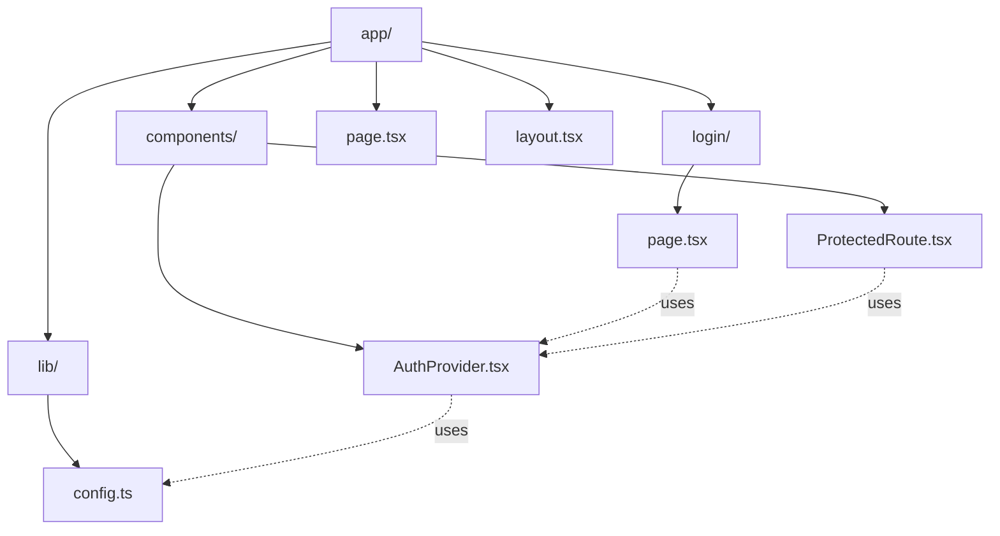
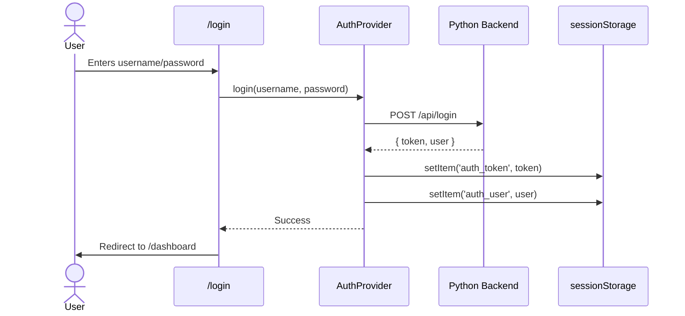
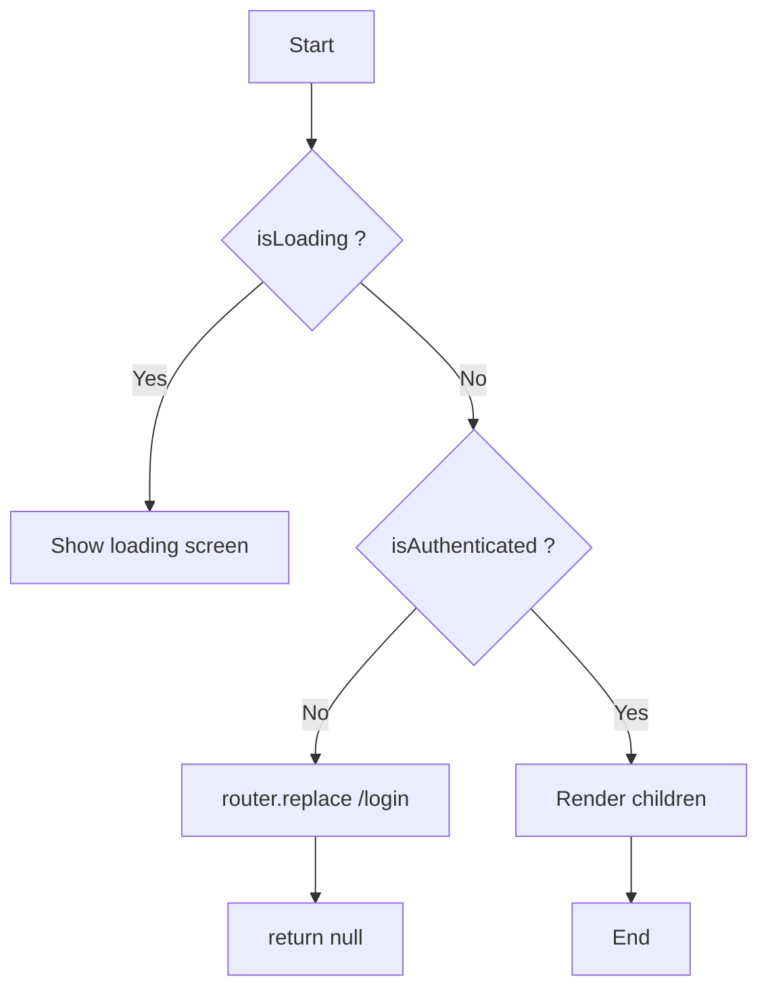
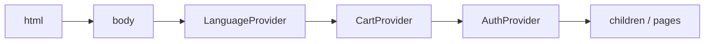

# Part 4: Authentication & Public Pages — Technical Documentation

> **Project:** Real-Time Notification System  
> **Stack:** Next.js 16 (App Router) · React 19 · TypeScript 5 · Tailwind CSS v4  
> **Author:** Frontend Team — Auth & Pages

---

## Table of Contents

1. [Overview](#1-overview)
2. [Getting Started](#2-getting-started)
3. [Architecture](#3-architecture)
4. [Files Created](#4-files-created)
   - [4.1 `app/lib/config.ts` — API Configuration](#41-applibconfigts--api-configuration)
   - [4.2 `app/components/AuthProvider.tsx` — Auth Context](#42-appcomponentsauthprovidertsx--auth-context)
   - [4.3 `app/components/ProtectedRoute.tsx` — Route Guard](#43-appcomponentsprotectedroutetsx--route-guard)
   - [4.4 `app/login/page.tsx` — Login Page](#44-apploginpagetsx--login-page)
   - [4.5 `app/page.tsx` — Landing Page](#45-apppagetsx--landing-page)
   - [4.6 `app/layout.tsx` — Root Layout](#46-applayouttsx--root-layout)
5. [Backend API Contract](#5-backend-api-contract)
6. [Action Required from Other Team Members](#6-action-required-from-other-team-members)
7. [Bugs Fixed During Implementation](#7-bugs-fixed-during-implementation)
8. [Environment Variables](#8-environment-variables)
9. [Dependencies](#9-dependencies)

---

## 1. Overview

This module handles **user authentication** and **public pages** for the real-time notification system. It provides:

- Login/logout system with token stored in `sessionStorage`
- A generic landing page presenting the application
- Route protection for pages that require authentication
- Centralized API endpoint configuration

---

## 2. Getting Started

### Prerequisites

| Tool | Version | Purpose |
|---|---|---|
| Node.js | 18+ | Run the Next.js frontend |
| npm | 9+ | Package management |

### Step 1 — Install Dependencies

```bash
npm install
```

### Step 2 — Start the Dev Server

```bash
npm run dev
```

The app will be available at **http://localhost:3000**

### Step 3 — Verify

Open `http://localhost:3000` in your browser. You should see:
- The **landing page** with the hero section and features
- Clicking **"Get Started →"** takes you to `/login`
- The login form renders with username + password fields

> **Note:** The login will fail until the backend Python server is running (see [Backend API Contract](#5-backend-api-contract)). This is expected — the frontend UI is fully functional, only the backend call will error.

---

## 3. Architecture

```
app/
├── components/
│   ├── AuthProvider.tsx        # Auth context (React Context)
│   └── ProtectedRoute.tsx     # Route guard wrapper
├── lib/
│   └── config.ts              # API base URL configuration
├── login/
│   └── page.tsx                # Login page
├── page.tsx                    # Landing page
└── layout.tsx                  # Root layout with providers
```



### Auth Flow



---

## 4. Files Created

### 4.1 `app/lib/config.ts` — API Configuration

A single source of truth for the backend API URL. Uses an environment variable with a fallback default.

```ts
export const API_BASE_URL = process.env.NEXT_PUBLIC_API_URL || 'http://localhost:8000';
```

- **Env variable:** `NEXT_PUBLIC_API_URL`
- **Default value:** `http://localhost:8000` (FastAPI default port)
- **Used by:** `AuthProvider` to call `/login` and `/signup` endpoints

---

### 4.2 `app/components/AuthProvider.tsx` — Auth Context

A React Context that manages authentication state globally across the application.

#### Types

```ts
type User = {
  name: string;
  username: string;
};

type AuthContextType = {
  user: User | null;
  token: string | null;
  isAuthenticated: boolean;
  login: (username: string, password: string) => Promise<void>;
  signup: (username: string, password: string) => Promise<void>;
  logout: () => void;
  isLoading: boolean;
};
```

#### Exposed API

| Property/Method | Type | Description |
|---|---|---|
| `user` | `User \| null` | Currently logged-in user |
| `token` | `string \| null` | Session token |
| `isAuthenticated` | `boolean` | `true` when a valid token exists |
| `login(username, password)` | `Promise<void>` | Calls `POST /login`, stores token on success |
| `signup(username, password)` | `Promise<void>` | Calls `POST /signup`, stores token on success |
| `logout()` | `void` | Clears token and user from state + sessionStorage |
| `isLoading` | `boolean` | `true` while restoring session on mount |

#### Behavior

1. **Initialization:** On mount, restores `token` and `user` from `sessionStorage` (per-tab persistence — allows multiple accounts in different tabs).
2. **Login:** Sends `POST {API_BASE_URL}/login` with `{ username, password }`. On success, stores token + user in React state and `sessionStorage`.
3. **Signup:** Sends `POST {API_BASE_URL}/signup` with `{ username, password }`. On success, stores token + user identically to login.
4. **Logout:** Removes token and user from state and `sessionStorage`.

#### Usage

```tsx
import { useAuth } from '@/app/components/AuthProvider';

function MyComponent() {
  const { user, isAuthenticated, logout } = useAuth();

  if (!isAuthenticated) return <p>Please log in</p>;

  return (
    <div>
      <p>Hello {user?.name}</p>
      <button onClick={logout}>Logout</button>
    </div>
  );
}
```

---

### 4.3 `app/components/ProtectedRoute.tsx` — Route Guard

A wrapper component that protects pages requiring authentication.



#### Behavior

1. **Loading:** While restoring session (`isLoading === true`), displays a centered loading indicator.
2. **Unauthenticated:** If not logged in, redirects to `/login` via `router.replace()`.
3. **Authenticated:** Renders the children.

#### Usage

```tsx
import ProtectedRoute from '@/app/components/ProtectedRoute';

export default function DashboardPage() {
  return (
    <ProtectedRoute>
      <div>Dashboard content here</div>
    </ProtectedRoute>
  );
}
```


---

### 4.4 `app/login/page.tsx` — Login Page

A login form with username and password fields.

#### Features

- **Form:** Username + password inputs with validation (button disabled when empty)
- **API call:** Uses `AuthProvider.login()` method
- **Redirect:** Navigates to `/dashboard` on successful login
- **Error handling:** Displays error messages from the backend in a styled alert
- **Loading state:** Shows "Signing in..." and disables the form during the request
- **Already logged in:** Redirects immediately to `/dashboard`
- **Design:** Clean centered card with background glow effect, consistent with the global design system

#### Page Layout

```
┌──────────────────────────────────┐
│          [Logo: N]               │
│       Notifications              │
│     Real-Time Dashboard          │
│                                  │
│  ┌──────────────────────────┐    │
│  │ Username                  │    │
│  │ [________________________]│    │
│  │                           │    │
│  │ Password                  │    │
│  │ [________________________]│    │
│  │                           │    │
│  │ ⚠ Error message (if any) │    │
│  │                           │    │
│  │ [ Sign In → ]             │    │
│  └──────────────────────────┘    │
│                                  │
│  Notification System · Real-Time │
└──────────────────────────────────┘
```


---

### 4.5 `app/page.tsx` — Landing Page

A generic landing page presenting the real-time notification application.

#### Sections

1. **Hero section:**
   - Stylized "N" logo in a red square
   - Large "Notifications" title
   - Subtitle describing the tech stack (Redis + Python)
   - "Get Started →" button linking to `/login`

2. **Features section:**
   - 4 feature cards in a responsive grid (2 columns desktop, 1 mobile)
   - Each card: icon, title, description

3. **Footer:**
   - Tech stack attribution

#### Design

- Background glow effect (blurred circles)
- Subtle pulse animation on the scroll indicator
- "Anton" font for headings
- Color palette: primary red (#EC3F28), secondary blue (#3950A1)


---

### 4.6 `app/layout.tsx` — Root Layout

Global layout wrapping all pages.



#### Changes

- **Metadata:** Generic title, description, and Open Graph tags for the notification app
- **Providers:**
  - `LanguageProvider` — Multi-language support (inherited)
  - `CartProvider` — Cart state (kept for backward compatibility with existing restaurant pages)
  - `AuthProvider` — Authentication state (new)
- **Fonts:** Google Fonts loaded (Anton, Outfit, Inter)
- **Global CSS:** `globals.css` with the design system

#### Metadata

```ts
title: {
  template: "%s | Notifications",
  default: "Notifications - Real-Time Dashboard",
},
description: "Real-time notification system powered by Redis pub/sub..."
```

---

## 5. Backend API Contract

The frontend expects the following endpoints from the Python backend:

### `POST /login`

Authenticates a user and returns a session token.

**Request:**
```json
{
  "username": "string",
  "password": "string"
}
```

**Response (200):**
```json
{
  "token": "string",
  "user": {
    "name": "string",
    "username": "string"
  }
}
```

**Response (401):**
```json
{
  "detail": "Invalid credentials"
}
```

---

### `POST /signup`

Creates a new user account and returns a session token.

**Request:**
```json
{
  "username": "string",
  "password": "string"
}
```

**Response (201):**
```json
{
  "token": "string",
  "user": {
    "name": "string",
    "username": "string"
  }
}
```

**Response (409):**
```json
{
  "detail": "Username already exists"
}
```

---

## 6. Action Required from Other Team Members

### 👉 To Person 1 (Backend Python)

- Implement `POST /login` and `POST /signup` at `http://localhost:8000`
- Use the request/response formats defined in [Backend API Contract](#5-backend-api-contract)
- Return HTTP `401` for invalid login, HTTP `409` for duplicate signup
- Store sessions in Redis with key `session:{token}` and a 24-hour TTL (as defined in Part 2)
- Configure CORS middleware to allow requests from `http://localhost:3000`

### 👉 To Person 3 (Frontend — Dashboard)

- Wrap your dashboard pages with `<ProtectedRoute>` to enforce authentication
- Use `useAuth()` to get the logged-in user's info and the `logout()` method
- Include the `Authorization: Bearer {token}` header from `useAuth().token` when calling `POST /notify`

**Example:**
```tsx
'use client';

import ProtectedRoute from '../components/ProtectedRoute';
import { useAuth } from '../components/AuthProvider';

export default function DashboardPage() {
  const { user, token, logout } = useAuth();

  return (
    <ProtectedRoute>
      <header>
        <span>Logged in as {user?.name}</span>
        <button onClick={logout}>Logout</button>
      </header>
      {/* Dashboard content */}
    </ProtectedRoute>
  );
}
```

### 👉 To Person 5 (Cleanup & Generalization)

- The `CartProvider` in `layout.tsx` is kept for backward compatibility with existing restaurant pages
- Once all restaurant-specific pages (`app/about/`, `app/contact/`, `app/menu/`, `app/[branch]/`, `app/history/`) are removed, `CartProvider` can be safely removed from the layout
- Preserve the `AuthProvider` wrapper — it is required by the new dashboard

---

## 7. Bugs Fixed During Implementation

| Bug | Root Cause | Fix Applied |
|---|---|---|
| **`setState during render` on login page** | `router.replace()` was called directly in the component render body (during the "already authenticated" check), triggering a React warning | Moved the redirect to a proper `useEffect` — the login page checks `isAuthenticated` inside `useEffect` and only calls `router.replace()` there |
| **Build failure: `useCart must be used within a CartProvider`** | The `CartProvider` was removed from `layout.tsx` while existing restaurant pages (`/contact`, `/about`, etc.) still depend on it | Restored `CartProvider` in the layout alongside `AuthProvider` — will be removed later by Person 5 after cleanup |
| **Login page renders login form briefly before redirecting** | The `AuthProvider` initializes with `isLoading: true`, so on page load the user appears unauthenticated for a split second before sessionStorage is read | Added `isLoading` state to `AuthProvider` — `ProtectedRoute` shows a loading screen instead of flashing the login page |
| **Token not persisted across page refreshes** | Token was stored in React state only, not in `sessionStorage` | Added `sessionStorage.setItem/getItem/removeItem` calls in `login()`, initialization `useEffect`, and `logout()` |

---

## 8. Environment Variables

| Variable | Description | Default |
|---|---|---|
| `NEXT_PUBLIC_API_URL` | Python backend URL | `http://localhost:8000` |

---

## 9. Dependencies

This module uses only dependencies already present in the project:

- `next` — Router and navigation (`useRouter`, `Link`)
- `react` — Hooks (`useState`, `useEffect`, `useCallback`, `createContext`, `useContext`)
- No external libraries were added
