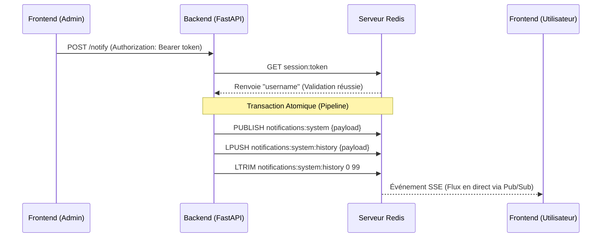
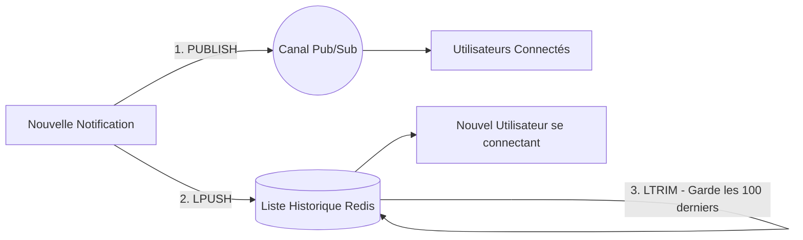

# Infrastructure Temp-Réel et Cache (Redis)

## 1. Vue d'Ensemble et Objectifs
L'objectif de cette section de l'architecture était de concevoir et d'implémenter une infrastructure de messagerie et de mise en cache robuste utilisant **Redis**. Cette couche sert de pont critique entre l'interface utilisateur (Next.js) et le serveur (FastAPI), permettant des notifications instantanées basées sur le push sans nécessiter de rafraîchissement de la page ou de requêtes répétées (polling).

L'implémentation exploite trois capacités distinctes de Redis :
1. **Courtier de messages en temps réel** (Message Broker) via Pub/Sub.
2. **Stockage temporaire des données** via les Listes (Lists).
3. **Gestion des sessions** via le système Clé-Valeur avec une durée de vie (TTL).

---

## 2. Architecture Globale

Le diagramme suivant illustre la manière dont les différents composants interagissent avec Redis pour assurer la diffusion des données en temps réel :

---

## 3. Structures de Données et Implémentation Redis

### 3.1. Messagerie en Temps Réel (Pub/Sub)
Pour assurer la livraison instantanée des notifications, nous avons implémenté le paradigme **Publish/Subscribe** de Redis.
- **Publication :** Lorsqu'une notification est créée, le backend FastAPI publie une charge utile JSON sur un canal Redis spécifique (ex. `notifications:system`, `notifications:alerts`).
- **Distribution (SSE) :** Les clients se connectent au backend via des événements envoyés par le serveur (Server-Sent Events - SSE). Le backend agit comme un abonné au canal Redis, poussant instantanément tout message entrant directement vers les clients connectés via le flux ouvert.

### 3.2. Historique et Cache des Notifications (Listes Redis)
Le système Pub/Sub seul ne distribue les messages qu'aux clients *actuellement connectés*. Afin de garantir que les utilisateurs qui se connectent ultérieurement ne manquent pas les notifications récentes, un mécanisme de mise en cache a été implémenté à l'aide des **Listes** Redis.

- **Mise en cache :** Chaque fois qu'un message est publié, il est simultanément ajouté au début d'une liste Redis en utilisant la commande `LPUSH`.
- **Gestion de la mémoire :** Pour éviter une consommation de mémoire illimitée, une limite stricte est imposée sur la taille de la liste à l'aide de la commande `LTRIM`, ne conservant que les 100 derniers messages.
- **Expiration (TTL) :** Une commande `EXPIRE` (TTL de 24 heures) est appliquée à la clé de l'historique, garantissant que les données obsolètes sont automatiquement purgées.

### 3.3. Gestion des Sessions (Clé-Valeur)
Afin d'éviter d'interroger la base de données relationnelle (SQLite) à chaque requête API, l'authentification des utilisateurs a été déportée vers Redis.
- **Stockage :** Lors d'une connexion réussie, le backend génère un jeton sécurisé et le stocke dans Redis sous forme de paire Clé-Valeur simple (`session:{token} -> username`).
- **TTL automatique :** La session utilise la commande `SETEX` pour expirer automatiquement après 24 heures, agissant efficacement comme un mécanisme de déconnexion automatique.
- **Déconnexion :** Lorsqu'un utilisateur se déconnecte manuellement, le backend émet instantanément une commande `DEL`, invalidant la session avec une complexité temporelle de O(1).

---

## 4. Intégration Frontend & Backend

### 4.1. Le Backend (FastAPI + sse-starlette)
Le composant le plus critique développé pour cette couche est le point de terminaison SSE (Server-Sent Events).
- **Architecture asynchrone :** L'abonné Redis a été implémenté sous forme de **générateur asynchrone** en utilisant des modèles non bloquants (`get_message()` combiné avec `asyncio.sleep()`). Ce choix architectural était vital pour empêcher l'écouteur Redis de bloquer la boucle d'événements asynchrone de FastAPI, permettant au serveur de gérer des centaines de connexions SSE simultanées efficacement.

### 4.2. Opérations Atomiques (Pipelines Redis)
Pour assurer la cohérence des données entre la diffusion en direct (Pub/Sub) et le cache d'historique (Listes), l'application utilise les **Pipelines Redis**. En regroupant les commandes `PUBLISH`, `LPUSH`, `EXPIRE` et `LTRIM` dans un seul bloc de transaction, le système garantit qu'une notification est soit entièrement traitée, soit pas du tout, tout en réduisant considérablement la latence réseau.

### 4.3. Le Frontend (Next.js)
Un hook React personnalisé (`useNotificationStream`) a été conçu pour consommer de manière transparente l'architecture Redis :
1. Il effectue d'abord une requête standard pour récupérer la liste d'historique depuis Redis.
2. Il ouvre ensuite une connexion `EventSource` pour écouter les diffusions en direct via Pub/Sub.
3. Il intègre un mécanisme intelligent anti-rebond (debounce) pour gérer gracieusement les reconnexions naturelles du flux SSE, évitant ainsi un scintillement de l'interface utilisateur.

---

